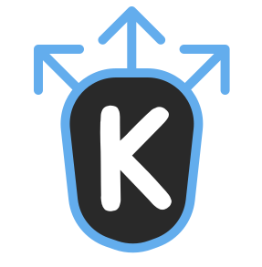
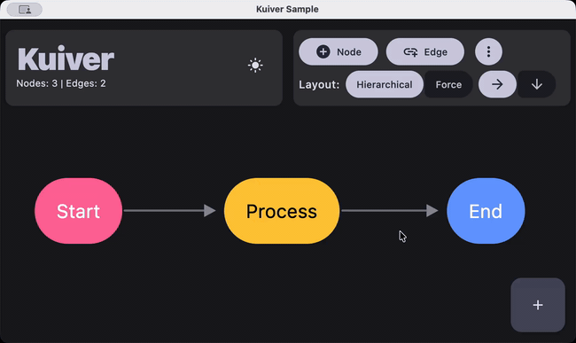
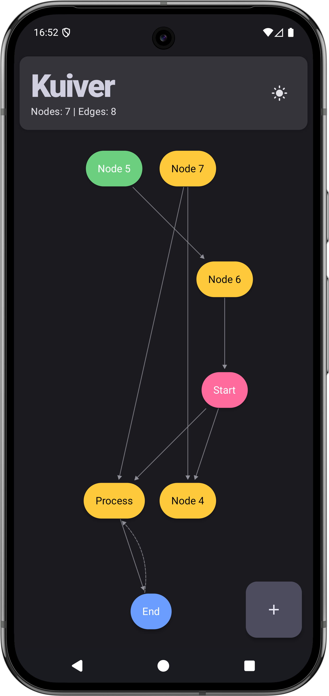
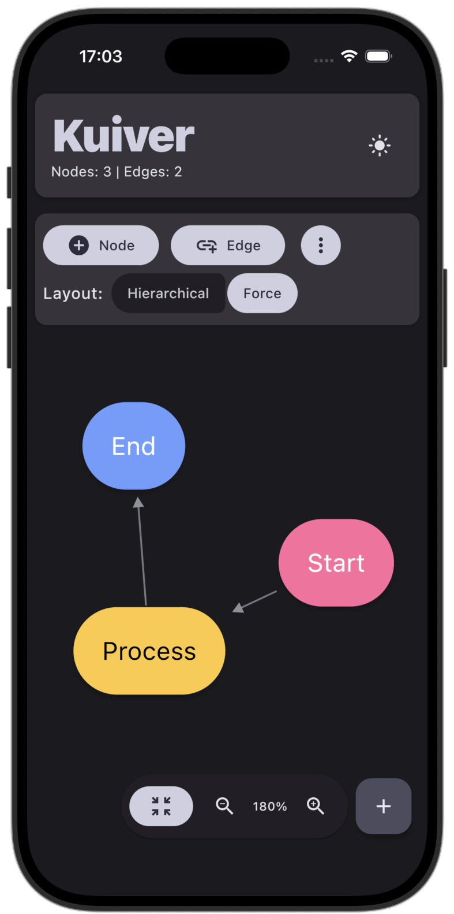
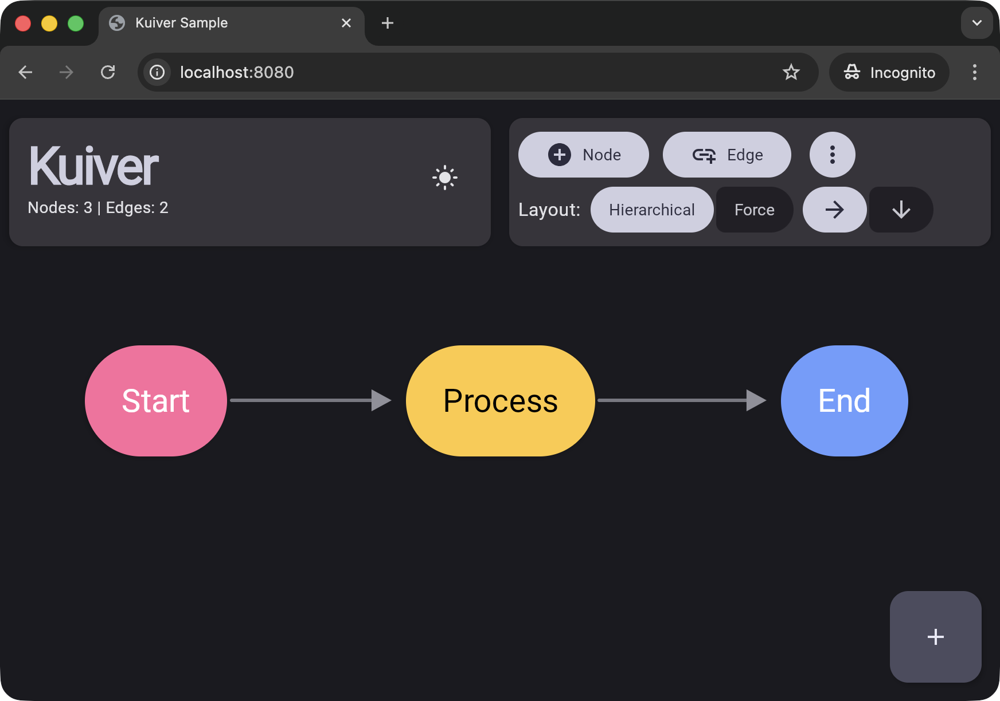

<div align="center">



# Kuiver

**A Kotlin Multiplatform graph visualization library**

[](https://central.sonatype.com/artifact/io.github.justdeko/kuiver)
[](https://opensource.org/licenses/Apache-2.0)



<br/>
<br/>

| **Android** | **iOS** | **Web** |
|:---:|:---:|:---:|
|  |  |  |

</div>

> **ALPHA RELEASE** - This library is in early development. The API is subject to change and may
> contain bugs.
> Feedback and bug reports are welcome
> at [GitHub Issues](https://github.com/justdeko/kuiver/issues).

## What it does

- 2 built-in layout algorithms (hierarchical and force-directed) plus support for custom layouts
- Handles both acyclic and cyclic graphs
- Customizable nodes and edges
- Zooming and panning
- Resizable canvas
- Layout animations

## Installation

Kuiver is available on Maven Central.

For multiplatform projects, add to your common source set:

```kotlin
kotlin {
    sourceSets {
        commonMain.dependencies {
            implementation("io.github.justdeko:kuiver:0.2.1")
        }
    }
}
```

Or for a specific platform only:

```kotlin
kotlin {
    sourceSets {
        androidMain.dependencies {
            implementation("io.github.justdeko:kuiver-android:0.2.1")
        }
        iosMain.dependencies {
            implementation("io.github.justdeko:kuiver-iosarm64:0.2.1")
        }
        // etc.
    }
}
```

### Supported Platforms

- Android (minSdk 24)
- iOS
- JVM (Desktop)
- Web (wasmJs/js) - experimental, see [limitations](#known-issues--limitations)

## Basic Usage

```kotlin
@Composable
fun MyGraphViewer() {
    // Create graph structure
    val kuiver = remember {
        buildKuiver {
            // Add nodes
            nodes("A", "B", "C")

            // Add edges
            edges(
                "A" to "B",
                "B" to "C",
                "A" to "C"
            )
        }
    }

    // Configure layout
    val layoutConfig = LayoutConfig.Hierarchical(
        direction = LayoutDirection.HORIZONTAL
    )

    // Create viewer state
    val viewerState = rememberKuiverViewerState(
        initialKuiver = kuiver,
        layoutConfig = layoutConfig
    )

    // Render the graph
    KuiverViewer(
        state = viewerState,
        nodeContent = { node ->
            // Customize node appearance
            Box(
                modifier = Modifier
                    .size(80.dp)
                    .background(Color.Blue, CircleShape),
                contentAlignment = Alignment.Center
            ) {
                Text(node.id, color = Color.White)
            }
        },
        edgeContent = { edge, from, to ->
            // Customize edge appearance
            EdgeContent(from, to, color = Color.Gray)
        }
    )
}
```

## Customization

### Node Data

Kuiver only handles visual graph structure using node IDs. Store your application data separately
and look it up by node ID in your `nodeContent` composable.

### Custom Edges

The `edgeContent` lambda receives the edge data and start/end positions (`from: Offset`,
`to: Offset`). You can use built-in components or create custom rendering with Canvas:

```kotlin
// Using built-in styled edges (automatically styles FORWARD, BACK, CROSS, SELF_LOOP)
edgeContent = { edge, from, to ->
    StyledEdgeContent(
        edge = edge,
        from = from,
        to = to,
        baseColor = Color.Black,
        backEdgeColor = Color(0xFFFF6B6B),
        strokeWidth = 3f
    )
}

// Custom edge rendering
edgeContent = { edge, from, to ->
    Canvas(modifier = Modifier.fillMaxSize()) {
        drawLine(
            color = Color.Blue,
            start = from,
            end = to,
            strokeWidth = 2.dp.toPx()
        )
        // Draw custom arrows, labels, etc.
    }
}
```

### Node Dimensions

Kuiver automatically measures node dimensions from your `nodeContent`. You can also specify
dimensions explicitly:

```kotlin
buildKuiver {
    // Auto-measured (recommended)
    nodes("A")

    // Explicit dimensions
    addNode(
        KuiverNode(
            id = "B",
            dimensions = NodeDimensions(width = 120.dp, height = 80.dp)
        )
    )
}
```

### Edge Anchor Points

By default, edges point and connect to the node center (with consideration of the node boundaries).
For precise control, you can define custom anchor points:

```kotlin
nodeContent = { node ->
    Box(modifier = Modifier.size(120.dp, 80.dp).background(Color.Blue)) {
        // Define anchors with optional visual indicators
        KuiverAnchor(
            anchorId = "left",
            nodeId = node.id,
            modifier = Modifier.align(Alignment.CenterStart)
        ) {
            Box(
                Modifier
                    .size(8.dp)
                    .background(Color.White, CircleShape)
            )
        }

        KuiverAnchor(
            anchorId = "right",
            nodeId = node.id,
            modifier = Modifier.align(Alignment.CenterEnd)
        )

        Text("Node ${node.id}", modifier = Modifier.align(Alignment.Center))
    }
}

// Reference anchors in edges
buildKuiver {
    nodes("A", "B")
    edge(
        from = "A",
        to = "B",
        fromAnchor = "right",
        toAnchor = "left"
    )
}
```

**Things to keep in mind:**
- Anchor IDs are scoped per-node (each node has its own namespace).
- Missing anchors or anchors that aren't found fallback to automatic edge positioning

See `ProcessDiagramDemo.kt` for a complete example with multiple anchors per side.

## Layout Algorithms

> **Note:** The layout algorithms are simple implementations based on established graph layouting
> techniques. While inspired by academic research, they are not direct ports of published
> implementations. Expect flaws and suboptimal layouts on complex graphs.

### Hierarchical Layout

Best for directed acyclic graphs (DAGs) and tree structures. Automatically handles cycles by
classifying back edges.

```kotlin
val layoutConfig = LayoutConfig.Hierarchical(
    direction = LayoutDirection.HORIZONTAL,  // or VERTICAL
    levelSpacing = 150f,      // Distance between hierarchy levels
    nodeSpacing = 100f        // Distance between nodes in same level
)
```

**Edge Types in Hierarchical Layout:**

- `FORWARD` - Edges to descendants (typical parent-child edges)
- `BACK` - Edges to ancestors (creates cycles, rendered as dashed by `StyledEdgeContent`)
- `CROSS` - Edges between nodes at similar hierarchy levels
- `SELF_LOOP` - Edges from a node to itself

### Force-Directed Layout

Best for understanding relationships in general graphs. Creates organic, balanced layouts using
physics simulation.

```kotlin
val layoutConfig = LayoutConfig.ForceDirected(
    iterations = 200,              // Simulation steps (more = better layout, slower)
    repulsionStrength = 500f,      // How strongly nodes push apart
    attractionStrength = 0.02f,    // How strongly connected nodes pull together
    damping = 0.85f                // Velocity damping (stability vs convergence speed)
)
```

### Custom Layouts

You can provide your own layout algorithm using `LayoutConfig.Custom`. This gives you full
control over node positioning.

```kotlin
// Define a custom circular layout
val circularLayout: LayoutProvider = { kuiver, config ->
    val nodesList = kuiver.nodes.values.toList()
    val radius = minOf(config.width, config.height) * 0.4f
    val centerX = config.width / 2f
    val centerY = config.height / 2f

    val updatedNodes = nodesList.mapIndexed { index, node ->
        val angle = (index.toFloat() / nodesList.size) * 2f * PI.toFloat()
        node.copy(
            position = Offset(
                x = centerX + radius * cos(angle),
                y = centerY + radius * sin(angle)
            )
        )
    }

    buildKuiverWithClassifiedEdges(updatedNodes, kuiver.edges)
}

// Use the custom layout
val layoutConfig = LayoutConfig.Custom(
    provider = circularLayout
)
```

**Custom Layout Tips:**

- Your layout function receives the `Kuiver` graph and `LayoutConfig` (use `LayoutConfig.Custom`)
- Access canvas dimensions via `config.width` and `config.height`
- Always use `buildKuiverWithClassifiedEdges(updatedNodes, kuiver.edges)` to construct the result
- Handle zero dimensions gracefully (canvas might not be measured yet on first layout)
- Use `remember` to stabilize your layout function in Compose to avoid unnecessary recompositions

## Viewer Configuration

Customize viewer behavior with `KuiverViewerConfig`:

```kotlin
KuiverViewer(
    state = viewerState,
    config = KuiverViewerConfig(
        // Visual
        showDebugBounds = false,           // Show node bounding boxes for debugging

        // Viewport
        fitToContent = true,               // Auto-fit graph to viewport on load
        contentPadding = 0.8f,             // Padding around content (0-1 scale)

        // Zoom
        minScale = 0.1f,                   // Minimum zoom level (10%)
        maxScale = 5f,                     // Maximum zoom level (500%)

        // Pan
        panVelocity = 1.0f,                // Scroll sensitivity (platform-specific default)

        // Animations
        scaleAnimationSpec = spring(       // Zoom animation
            dampingRatio = Spring.DampingRatioMediumBouncy,
            stiffness = Spring.StiffnessLow
        ),
        offsetAnimationSpec = spring(), // Pan animation
        nodeAnimationSpec = spring(),   // Node position animation (during layout)

        // Desktop-specific
        zoomConditionDesktop = { event ->  // When to zoom vs pan on desktop
            event.keyboardModifiers.isCtrlPressed
        }
    ),
    nodeContent = { node -> /* ... */ },
    edgeContent = { edge, from, to -> /* ... */ }
)
```

## Interaction & State Management

### Programmatic Controls

```kotlin
// Zoom and navigation
viewerState.zoomIn()       // Zoom in (1.2x)
viewerState.zoomOut()      // Zoom out (1/1.2x)
viewerState.centerGraph()  // Center graph in viewport

// Direct control
viewerState.updateTransform(scale = 1.5f, offset = Offset(100f, 100f))

// Access current state
val currentScale = viewerState.scale
val currentOffset = viewerState.offset
```

### User Interactions

- **Touch/Mobile:** Drag to pan, pinch to zoom
- **Mouse/Desktop:** Drag to pan, scroll to pan, Ctrl+Scroll to zoom

### State Persistence

Use `rememberSaveableKuiverViewerState` to preserve zoom/pan across process death.

### Updating the Graph

Update the graph structure by passing an updated or new `Kuiver` instance with
`viewerState.updateKuiver(newKuiver)`.

## Advanced Features

### Cycle Detection

```kotlin
val kuiver = buildKuiver {
    nodes("A", "B", "C")
    edges(
        "A" to "B",
        "B" to "C"
    )

    // Check before adding edge that would create a cycle
    if (!wouldCreateCycle(from = "C", to = "A")) {
        edge("C", "A")
    } else {
        println("Skipping edge C -> A: would create a cycle")
    }
}

// Check existing graph
if (kuiver.hasCycles()) {
    val components = kuiver.findStronglyConnectedComponents()
    println("Strongly connected components: $components")
}
```

### Edge Classification

```kotlin
val kuiver = buildKuiver {
    nodes("A", "B", "C")
    edges(
        "A" to "B",
        "B" to "C",
        "C" to "A"  // Back edge (creates cycle)
    )
}

// Classify all edges
val edgeTypes = kuiver.classifyAllEdges()
edgeTypes.forEach { (edge, type) ->
    println("${edge.fromId} -> ${edge.toId}: $type")
}
// Output:
// A -> B: FORWARD
// B -> C: FORWARD
// C -> A: BACK
```

### Topological Ordering

```kotlin
// For DAGs or graphs with back edges removed
val order = kuiver.getTopologicalOrder()
println("Topological order: $order")
// Useful for dependency resolution, task scheduling, etc.
```

## Sample Application

A complete demo app is included in [`/sample`](./sample). Open the project in **IntelliJ IDEA** or **Android Studio**, sync, and select a run configuration (Desktop/Android/iOS/Web) from the dropdown.

You can also run from the command line:

```bash
./gradlew :sample:composeApp:run  # Desktop
```

## Known Issues & Limitations

### Web Platform

The Web target is **experimental** and has known issues.

The library implements several web-specific adjustments to handle browser limitations:

- **Reduced Pan Velocity**: Default pan velocity is `4f` (vs `30f` on native platforms) to
  compensate for higher scroll sensitivity in browsers
    - See: `core/src/wasmJsMain/kotlin/com/dk/kuiver/renderer/PlatformDefaults.wasmJs.kt:4`
- **Font Loading Delay**: 100ms delay on initial node measurement to prevent text wrapping issues
  when browser fonts haven't finished loading
    - See: `core/src/wasmJsMain/kotlin/com/dk/kuiver/renderer/PlatformDefaults.wasmJs.kt:5`
    - This delay only occurs once on initial render

### General Limitations

- **Multiple Edges**: The library does not currently support multiple edges between the same pair of
  nodes
- **Edge Labels**: Built-in edge label support is not yet implemented (can be added via custom
  `edgeContent`)
- **Large Graphs**: Performance with graphs >100 nodes has not been extensively tested

### API Stability

As an alpha release, the public API may change between versions. Breaking changes will be noted in
the changelog.

## Contributing

Contributions are welcome! Please see [CONTRIBUTING.md](CONTRIBUTING.md) for guidelines on:
- Reporting bugs and requesting features
- Contributing code and submitting pull requests
- Development setup and testing

## Why "Kuiver"?

In mathematics, a [*quiver*](https://en.wikipedia.org/wiki/Quiver_(mathematics)) is a directed graph
in its most general sense.

"K" instead of "Q" for Kotlin. Just pronounce it like quiver: `/ˈkwɪvər/`

From Wikipedia:

> "a quiver is another name for a multidigraph; that is, a directed graph where loops and multiple
> arrows between two vertices are allowed."

Technically this library is not quite a "true" quiver, as it doesn't support multiple edges between
the same two nodes.
