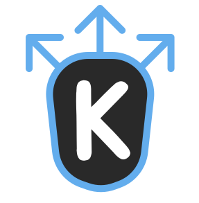
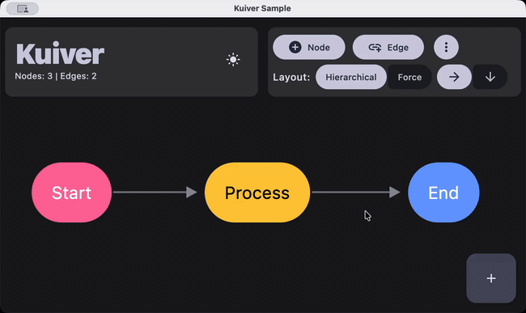
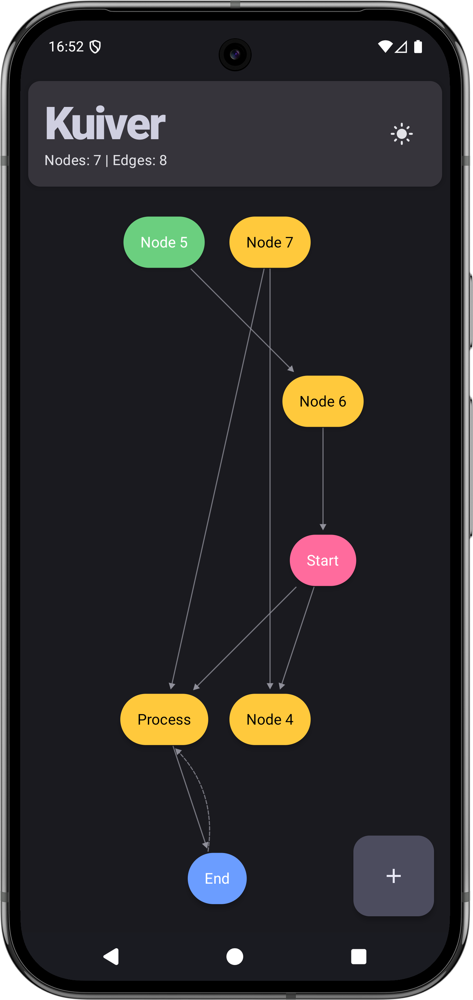
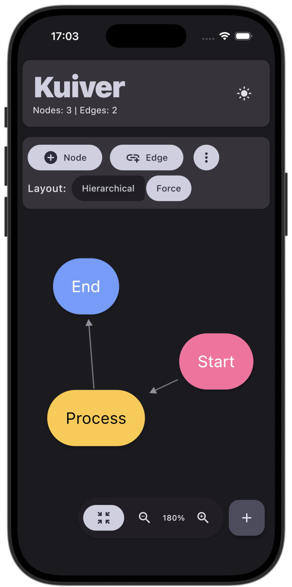
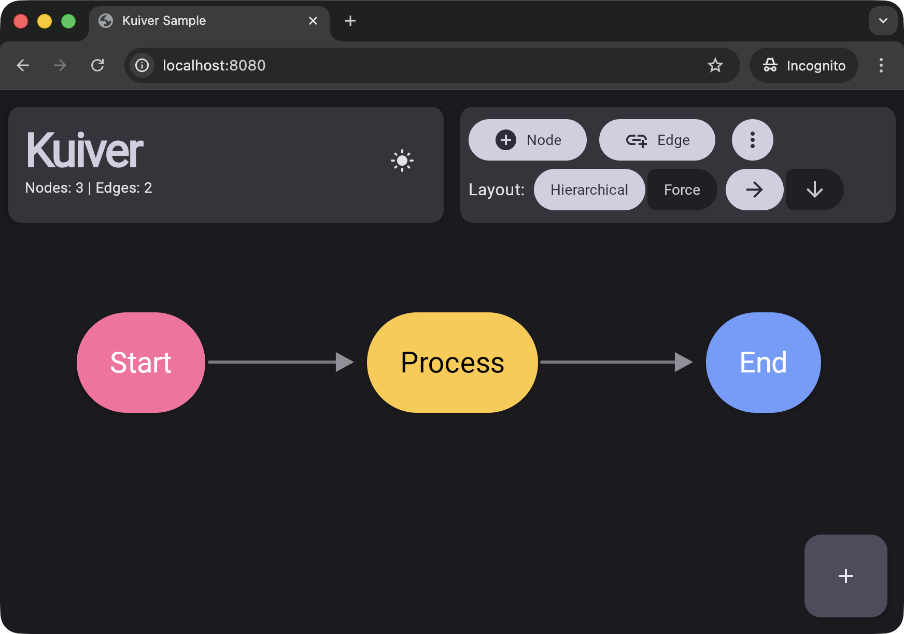

<div align="center">



# Kuiver

**A Kotlin Multiplatform graph visualization library**

[](https://central.sonatype.com/artifact/io.github.justdeko/kuiver)
[](https://opensource.org/licenses/Apache-2.0)



<br/>
<br/>

| **Android** | **iOS** | **Web** |
|:---:|:---:|:---:|
|  |  |  |

</div>

> **ALPHA RELEASE** - This library is in early development. The API is subject to change and may
> contain bugs.
> Feedback and bug reports are welcome
> at [GitHub Issues](https://github.com/justdeko/kuiver/issues).

## What it does

- 2 built-in layout algorithms (hierarchical and force-directed) plus support for custom layouts
- Handles both acyclic and cyclic graphs
- Customizable nodes and edges
- Edge labels
- Zooming and panning
- Node selection, hover and drag to reposition
- Resizable canvas
- Layout animations

## Installation

Kuiver is available on Maven Central.

For multiplatform projects, add to your common source set:

```kotlin
kotlin {
    sourceSets {
        commonMain.dependencies {
            implementation("io.github.justdeko:kuiver:0.4.0")
        }
    }
}
```

Or for a specific platform only:

```kotlin
kotlin {
    sourceSets {
        androidMain.dependencies {
            implementation("io.github.justdeko:kuiver-android:0.4.0")
        }
        iosMain.dependencies {
            implementation("io.github.justdeko:kuiver-iosarm64:0.4.0")
        }
        // etc.
    }
}
```

### Supported Platforms

- Android (minSdk 24)
- iOS
- JVM (Desktop)
- Web (wasmJs/js) - experimental, see [limitations](#known-issues--limitations)

## Basic Usage

```kotlin
@Composable
fun MyGraphViewer() {
    // Create graph structure
    val kuiver = remember {
        buildKuiver {
            // Add nodes
            nodes("A", "B", "C")

            // Add edges
            edges(
                "A" to "B",
                "B" to "C",
                "A" to "C"
            )
        }
    }

    // Configure layout
    val layoutConfig = LayoutConfig.Hierarchical(
        direction = LayoutDirection.HORIZONTAL
    )

    // Create viewer state
    val viewerState = rememberKuiverViewerState(
        initialKuiver = kuiver,
        layoutConfig = layoutConfig
    )

    // Render the graph
    KuiverViewer(
        state = viewerState,
        nodeContent = { node ->
            // Customize node appearance
            Box(
                modifier = Modifier
                    .size(80.dp)
                    .background(Color.Blue, CircleShape),
                contentAlignment = Alignment.Center
            ) {
                Text(node.id, color = Color.White)
            }
        },
        edgeContent = { edge, from, to ->
            // Customize edge appearance
            EdgeContent(from, to, color = Color.Gray)
        }
    )
}
```

## Customization

### Node Data

Kuiver only handles visual graph structure using node IDs. Store your application data separately
and look it up by node ID in your `nodeContent` composable.

### Custom Edges

The `edgeContent` lambda receives the edge data and start/end positions (`from: Offset`,
`to: Offset`). You can use built-in components or create custom rendering with Canvas:

```kotlin
// Using built-in styled edges (automatically styles FORWARD, BACK, CROSS, SELF_LOOP)
edgeContent = { edge, from, to ->
    StyledEdgeContent(
        edge = edge,
        from = from,
        to = to,
        baseColor = Color.Black,
        backEdgeColor = Color(0xFFFF6B6B),
        strokeWidth = 3f
    )
}

// Custom edge rendering
edgeContent = { edge, from, to ->
    val path = remember(from, to) { EdgePathFactory.createStraightPath(from, to) }
    EdgeCanvas(remember(path) { path.boundingRect() }) {
        drawLine(
            color = Color.Blue,
            start = path.from,
            end = path.pathEndpoint,
            strokeWidth = 2.dp.toPx()
        )
        // Draw custom arrows, labels, etc.
    }
}
```

### Edge Labels

Use `EdgeContentWithLabel` (or `StyledEdgeContent`) to display text along an edge. Labels
automatically hide on edges shorter than `minEdgeLengthForLabel` and can optionally rotate
to follow the edge direction.

```kotlin
edgeContent = { edge, from, to ->
    EdgeContentWithLabel(
        from = from,
        to = to,
        label = "my label",
        labelPlacement = LabelPlacement.CENTER, // START, CENTER, or END
        labelStyle = EdgeLabelStyle(
            textColor = Color.Black,
            backgroundColor = Color.White.copy(alpha = 0.9f),
            fontSize = 12.sp,
            rotateWithEdge = false
        )
    )
}

// or use a custom composable as the label
edgeContent = { edge, from, to ->
    EdgeContentWithLabel(
        from = from,
        to = to,
        label = "custom",
        labelContent = { text ->
            Text(text, color = Color.Red, fontWeight = FontWeight.Bold)
        }
    )
}
```

`StyledEdgeContent` also accepts the same label parameters, so you can combine automatic
edge styling with labels in one call.

### Theming

Kuiver depends on compose `runtime` + `foundation` + `ui` only, so it can't read `MaterialTheme`
directly. However you can use`LocalKuiverColors`. Provide it once instead of overriding colors
in every `edgeContent` lambda:

```kotlin
CompositionLocalProvider(
    LocalKuiverColors provides KuiverColors(
        edge = MaterialTheme.colorScheme.onSurface,
        backEdge = MaterialTheme.colorScheme.tertiary,
        labelText = MaterialTheme.colorScheme.onSurface,
        labelBackground = MaterialTheme.colorScheme.surface,
    ),
) {
    KuiverViewer(
        state = viewerState,
        nodeContent = { node -> Text(node.id) },
        edgeContent = { edge, from, to -> StyledEdgeContent(edge, from, to) }
    )
}
```

### Custom Arrow Drawing

Replace the default filled-triangle arrow with any `DrawScope` lambda via the `arrowDrawer`
parameter, available on all edge composables:

```kotlin
val circleArrow: ArrowDrawer = { arrowTip, direction, color ->
    drawCircle(color = color, radius = 8f, center = arrowTip)
}

edgeContent = { edge, from, to ->
    EdgeContent(from, to, arrowDrawer = circleArrow)
}
```

### Node Dimensions

Kuiver automatically measures node dimensions from your `nodeContent`. You can also specify
dimensions explicitly:

```kotlin
buildKuiver {
    // Auto-measured (recommended)
    nodes("A")

    // Explicit dimensions
    addNode(
        KuiverNode(
            id = "B",
            dimensions = NodeDimensions(width = 120.dp, height = 80.dp)
        )
    )
}
```

Auto-measured nodes are measured while they render, with unbounded constraints, so a node is as
large as its content wants to be. The measurement is repeated whenever the content changes size, and
the graph is laid out again with the new sizes, so nodes that grow or shrink at runtime keep their
spacing. Nodes with explicit dimensions are held to them, and their content is given that much room.

### Edge Anchor Points

By default, edges point and connect to the node center (with consideration of the node boundaries).
For precise control, you can define custom anchor points:

```kotlin
nodeContent = { node ->
    Box(modifier = Modifier.size(120.dp, 80.dp).background(Color.Blue)) {
        // Define anchors with optional visual indicators
        KuiverAnchor(
            anchorId = "left",
            nodeId = node.id,
            modifier = Modifier.align(Alignment.CenterStart)
        ) {
            Box(
                Modifier
                    .size(8.dp)
                    .background(Color.White, CircleShape)
            )
        }

        KuiverAnchor(
            anchorId = "right",
            nodeId = node.id,
            modifier = Modifier.align(Alignment.CenterEnd)
        )

        Text("Node ${node.id}", modifier = Modifier.align(Alignment.Center))
    }
}

// Reference anchors in edges
buildKuiver {
    nodes("A", "B")
    edge(
        from = "A",
        to = "B",
        fromAnchor = "right",
        toAnchor = "left"
    )
}
```

**Things to keep in mind:**
- Anchor IDs are scoped per-node (each node has its own namespace).
- Missing anchors or anchors that aren't found fallback to automatic edge positioning

See `ProcessDiagramDemo.kt` for a complete example with multiple anchors per side.

## Layout Algorithms

> **Note:** The layout algorithms are simple implementations based on established graph layouting
> techniques. While inspired by academic research, they are not direct ports of published
> implementations. Expect flaws and suboptimal layouts on complex graphs.

Every length a layout deals with is a `Dp`: the canvas size in `LayoutConfig`, the spacing options,
node dimensions, and the `DpOffset` positions a layout writes to each node. `150.dp` of spacing is
therefore the same physical distance on a 1x desktop screen and a 3x phone, and there is no pixel
value anywhere in the graph coordinate space to mix it up with.

### Hierarchical Layout

Best for directed acyclic graphs (DAGs) and tree structures. Automatically handles cycles by
classifying back edges.

```kotlin
val layoutConfig = LayoutConfig.Hierarchical(
    direction = LayoutDirection.HORIZONTAL,  // or VERTICAL
    levelSpacing = 150.dp,    // Distance between hierarchy levels
    nodeSpacing = 100.dp      // Distance between nodes in same level
)
```

**Edge Types in Hierarchical Layout:**

- `FORWARD` - Edges to descendants (typical parent-child edges)
- `BACK` - Edges to ancestors (creates cycles, rendered as dashed by `StyledEdgeContent`)
- `CROSS` - Edges between nodes at similar hierarchy levels
- `SELF_LOOP` - Edges from a node to itself

### Force-Directed Layout

Best for understanding relationships in general graphs. Creates organic, balanced layouts using
physics simulation.

```kotlin
val layoutConfig = LayoutConfig.ForceDirected(
    iterations = 200,              // Simulation steps (more = better layout, slower)
    repulsionStrength = 500f,      // How strongly nodes push apart
    attractionStrength = 0.02f,    // How strongly connected nodes pull together
    damping = 0.85f                // Velocity damping (stability vs convergence speed)
)
```

### Custom Layouts

You can provide your own layout algorithm using `LayoutConfig.Custom`. This gives you full
control over node positioning.

```kotlin
// Define a custom circular layout
val circularLayout: LayoutProvider = { kuiver, config ->
    val nodesList = kuiver.nodes.values.toList()
    val radius = minOf(config.width, config.height) * 0.4f
    val centerX = config.width / 2f
    val centerY = config.height / 2f

    val updatedNodes = nodesList.mapIndexed { index, node ->
        val angle = (index.toFloat() / nodesList.size) * 2f * PI.toFloat()
        node.copy(
            position = DpOffset(
                x = centerX + radius * cos(angle),
                y = centerY + radius * sin(angle)
            )
        )
    }

    buildKuiverWithClassifiedEdges(updatedNodes, kuiver.edges)
}

// Use the custom layout
val layoutConfig = LayoutConfig.Custom(
    provider = circularLayout
)
```

**Custom Layout Tips:**

- Your layout function receives the `Kuiver` graph and `LayoutConfig` (use `LayoutConfig.Custom`)
- Access canvas dimensions via `config.width` and `config.height`, both `Dp`
- Write each node a `DpOffset` position. `Dp` multiplies as `spacing * count`, never `count * spacing`
- Always use `buildKuiverWithClassifiedEdges(updatedNodes, kuiver.edges)` to construct the result
- Handle zero dimensions gracefully (canvas might not be measured yet on first layout)
- Use `remember` to stabilize your layout function in Compose to avoid unnecessary recompositions

## Viewer Configuration

Customize viewer behavior with `KuiverViewerConfig`:

```kotlin
KuiverViewer(
    state = viewerState,
    config = KuiverViewerConfig(
        // Visual
        showDebugBounds = false,           // Show node bounding boxes for debugging

        // Viewport
        fitToContent = true,               // Auto-fit graph to viewport on load
        contentPadding = 0.8f,             // Fraction of the viewport the graph fills when fitted

        // Zoom (applies to gestures, centerGraph() and zoomIn()/zoomOut())
        minScale = 0.1f,                   // Minimum zoom level (10%)
        maxScale = 5f,                     // Maximum zoom level (500%)
        zoomStep = 1.2f,                   // Multiplier applied by zoomIn()/zoomOut()
        zoomVelocity = 0.05f,              // Scroll zoom sensitivity, per scroll unit

        // Pan
        panVelocity = 15f,                 // Scroll sensitivity, dp per scroll unit.

        // Interaction, all off by default
        selectionMode = SelectionMode.NONE,          // NONE, SINGLE or MULTIPLE
        nodeDragEnabled = false,           // Drag nodes to reposition them
        hoverEnabled = false,              // Track the node under the pointer
        relayoutPolicy = RelayoutPolicy.KEEP_MANUAL, // What layout does to dragged nodes

        // Animations
        scaleAnimationSpec = spring(       // Zoom animation
            dampingRatio = Spring.DampingRatioMediumBouncy,
            stiffness = Spring.StiffnessMedium
        ),
        offsetAnimationSpec = spring(), // Pan animation
        layoutAnimationSpec = spring(), // Progress of a layout change, shared by nodes and edges
        animateInitialPlacement = false,// Whether the very first placement animates too
        enterAnimationSpec = null,      // animation when the graph is ready, none when null

        // Desktop-specific
        zoomConditionDesktop = { event ->  // When to zoom vs pan on desktop
            event.keyboardModifiers.isCtrlPressed
        }
    ),
    nodeContent = { node -> /* ... */ },
    edgeContent = { edge, from, to -> /* ... */ }
)
```

## Interaction & State Management

### Programmatic Controls

```kotlin
// Zoom and navigation (animated)
viewerState.zoomIn()                       // Zoom in by config.zoomStep (default 1.2x)
viewerState.zoomOut()                      // Zoom out by config.zoomStep
viewerState.centerGraph()                  // Center and fit graph in viewport
viewerState.centerGraph(animated = false)  // Snap without animation

// Direct control, panning in graph dp
viewerState.updateTransform(scale = 1.5f, offset = DpOffset(100.dp, 100.dp))
viewerState.updateTransform(scale = 1.5f, offset = DpOffset(100.dp, 100.dp), animated = true)

// Access current state
val currentScale = viewerState.scale
val currentOffset = viewerState.offset
val isReady = viewerState.hasFittedInitially  // true when first auto-fit completes
```

`zoomIn()`, `zoomOut()` and `centerGraph()` read `contentPadding`, `minScale`, `maxScale` and
`zoomStep` from the `KuiverViewerConfig` of the `KuiverViewer` the state is passed to, so they stay
in sync with gestures. `updateTransform` is unclamped by design — it sets exactly what you ask for.

### User Interactions

- **Touch/Mobile:** Drag to pan, pinch to zoom
- **Mouse/Desktop:** Drag to pan, scroll to pan, Ctrl+Scroll to zoom

### Selecting, Hovering and Dragging Nodes

You can enable hovering and dragging nodes, then respond to them with `KuiverInteractionCallbacks`:

```kotlin
KuiverViewer(
    state = viewerState,
    config = KuiverViewerConfig(
        selectionMode = SelectionMode.SINGLE,
        nodeDragEnabled = true,
        hoverEnabled = true
    ),
    callbacks = KuiverInteractionCallbacks(
        onNodeClick = { node -> println("clicked ${node.id}") },
        onNodeLongPress = { node -> showMenuFor(node) },
        onNodeDragEnd = { node, travelled -> println("${node.id} moved by $travelled") },
        onCanvasClick = { println("deselected") }
    ),
    nodeContent = { node -> /* ... */ },
    edgeContent = { edge, from, to -> StyledEdgeContent(edge, from, to) }
)
```

Additionally, you have `KuiverNodeScope` with `isSelected`, `isHovered` and `isDragging`:

```kotlin
nodeContent = { node ->
    Box(
        Modifier
            .size(120.dp, 60.dp)
            .border(
                width = if (isSelected) 3.dp else 1.dp,
                color = if (isHovered) MaterialTheme.colorScheme.primary else Color.Gray
            )
    ) { Text(node.id) }
}
```

`isHovered` is always false on touch, which has no hover.

The same state is readable and writable from `viewerState.interaction`:

```kotlin
val selected = viewerState.interaction.selectedNodeIds
val hovered = viewerState.interaction.hoveredNodeId
val dragging = viewerState.interaction.isDragging

viewerState.interaction.select("A")
viewerState.interaction.toggleSelection("B")
viewerState.interaction.clearSelection()
```

#### Where Dragged Nodes End Up

A drag saves the node's new position into the graph and remembers it as a manual position.
`relayoutPolicy` decides what the next layout pass does with it:

- `RelayoutPolicy.KEEP_MANUAL` (default) puts dragged nodes back where the user left them and lays
  out the rest as usual
- `RelayoutPolicy.RELAYOUT_ALL` gives every position back to the algorithm, so a drag survives only
  until the graph, the node sizes or the canvas next change

You can also set and get these positions programmatically:

```kotlin
viewerState.moveNode("A", DpOffset(120.dp, 40.dp))  // absolute, in graph dp
viewerState.moveNodeBy("A", DpOffset(10.dp, 0.dp))  // relative

viewerState.manualPositions
viewerState.clearManualPositions()
viewerState.relayout()
```

### State Persistence

Use `rememberSaveableKuiverViewerState` to preserve zoom/pan across process death.

### Updating the Graph

A `Kuiver` is immutable. `buildKuiver { }` is a simple constructor dsl and every change afterwards 
hands back a new graph instead of modifying the old one. Two graphs
with the same nodes and edges are equal, so they work as snapshot state and as `remember` keys.

Derive the new graph and hand it to `viewerState.updateKuiver(newKuiver)`:

```kotlin
val graph = buildKuiver {
    nodes("A", "B")
    edge("A", "B")
}

// Single changes
val withNode = graph.withNode(KuiverNode("C"))
val withEdge = withNode.withEdge(KuiverEdge("B", "C"))
val trimmed = withEdge.withoutNode("A")     // also drops the edges touching A
val unlinked = withEdge.withoutEdge("A", "B")

// Batches, back in the builder
val extended = graph.rebuild {
    nodes("C", "D")
    edges("B" to "C", "C" to "D")
}

viewerState.updateKuiver(extended)
```

`withNode` replaces a node that already carries the same id and leaves its edges alone, which is how
you move a node or give it explicit dimensions. `withEdge` throws if either endpoint is missing from
the graph.

`withoutEdge` drops an edge from the graph. It takes either endpoints or an edge:

```kotlin
graph.withoutEdge("A", "B")                 // whatever edge connects them
graph.withoutEdge(someEdgeFromTheGraph)     // that exact edge
```

## Advanced Features

### Batched Edges (Large Graphs)

Each edge composable is a layout node to compose, measure and draw, and every edge recomposes on
every frame of a layout animation to pick up its new end points.

Pass `edgeStyle` instead of `edgeContent` to draw the whole edge set from one canvas, with
end points resolved in the draw phase:

```kotlin
KuiverViewer(
    state = viewerState,
    nodeContent = { node -> /* ... */ },
    edgeStyle = { edge ->
        EdgeStyle.styled(edge, baseColor = Color.Gray)      // the StyledEdgeContent look
    }
)
```

`EdgeStyle` has the same parameters as the edge composables:

```kotlin
edgeStyle = { edge ->
    EdgeStyle(
        color = if (edge.type == EdgeType.BACK) Color.Red else Color.Gray,
        strokeWidth = 2f,
        dashed = edge.type == EdgeType.BACK,
        shape = EdgeShape.ORTHOGONAL // AUTO, STRAIGHT, CURVED, ORTHOGONAL, RIGHT_ANGLE
    )
}
```

Edges are values rather than composables here, so they cannot hold composable content. No edge
labels in this mode.

The `edgeStyle` lambda also runs while drawing rather than while composing, so it cannot read
`LocalKuiverColors` itself. `KuiverDefaults.edgeStyle()` reads the colors in composition and returns
a lambda closing over them:

```kotlin
KuiverViewer(
    state = viewerState,
    nodeContent = { node -> Text(node.id) },
    edgeStyle = KuiverDefaults.edgeStyle()
)
```

### Cycle Detection

```kotlin
val kuiver = buildKuiver {
    nodes("A", "B", "C")
    edges(
        "A" to "B",
        "B" to "C"
    )

    // Check before adding edge that would create a cycle
    if (!wouldCreateCycle(from = "C", to = "A")) {
        edge("C", "A")
    } else {
        println("Skipping edge C -> A: would create a cycle")
    }
}

// Check existing graph
if (kuiver.hasCycles()) {
    val components = kuiver.findStronglyConnectedComponents()
    println("Strongly connected components: $components")
}
```

### Edge Classification

```kotlin
val kuiver = buildKuiver {
    nodes("A", "B", "C")
    edges(
        "A" to "B",
        "B" to "C",
        "C" to "A"  // Back edge (creates cycle)
    )
}

// Classify all edges
val edgeTypes = kuiver.classifyAllEdges()
edgeTypes.forEach { (edge, type) ->
    println("${edge.fromId} -> ${edge.toId}: $type")
}
// Output:
// A -> B: FORWARD
// B -> C: FORWARD
// C -> A: BACK
```

### Topological Ordering

```kotlin
// For DAGs or graphs with back edges removed
val order = kuiver.getTopologicalOrder()
println("Topological order: $order")
// Useful for dependency resolution, task scheduling, etc.
```

## Sample Application

A complete demo app is included in [`/sample`](./sample). Open the project in **IntelliJ IDEA** or **Android Studio**, sync, and select a run configuration (Desktop/Android/iOS/Web) from the dropdown.

You can also run from the command line:

```bash
./gradlew :sample:composeApp:run  # Desktop
```

## Known Issues & Limitations

### Web Platform

The Web target is **experimental** and has known issues.

The library implements several web-specific adjustments to handle browser limitations:

- **Reduced Scroll Velocities**: `panVelocity` defaults to `2f` on js/wasmJs (vs `15f` on Android,
  iOS and desktop) and `zoomVelocity` to `0.0067f` (vs `0.05f`) to compensate for higher scroll
  sensitivity in browsers
- **Late Fonts**: a font that finishes loading after the first frame re-measures the text in your
  nodes. Kuiver measures nodes as it renders them and lays the graph out again when those
  measurements change, so the nodes end up correctly sized either way. This only arises if you
  bundle your own font: the default font family is compiled into the Skia binary and needs no fetch.
  To avoid the one-time reflow when you do bundle one, preload it before showing the viewer, with
  `preloadFont` from `compose.components.resources` (web only) and a
  `<link rel="preload" as="fetch">` in your `index.html`

### General Limitations

- **Multiple Edges**: The library does not currently support multiple edges between the same pair of
  nodes

### API Stability

As an alpha release, the public API may change between versions. Breaking changes will be noted in
the changelog.

## Contributing

Contributions are welcome! Please see [CONTRIBUTING.md](CONTRIBUTING.md) for guidelines on:
- Reporting bugs and requesting features
- Contributing code and submitting pull requests
- Development setup and testing

## Why "Kuiver"?

In mathematics, a [*quiver*](https://en.wikipedia.org/wiki/Quiver_(mathematics)) is a directed graph
in its most general sense.

"K" instead of "Q" for Kotlin. Just pronounce it like quiver: `/ˈkwɪvər/`

From Wikipedia:

> "a quiver is another name for a multidigraph; that is, a directed graph where loops and multiple
> arrows between two vertices are allowed."

Technically this library is not quite a "true" quiver, as it doesn't support multiple edges between
the same two nodes.
